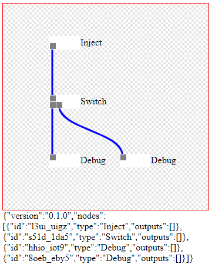

 <div align="center">
  
  <h2>Fungsi Maju</h2>
  <blockquote>Library javascript untuk memproses fungsi berantai dengan format JSON</blockquote>
  <a href="https://www.npmjs.com/package/fungsi-maju"></a> <a href="https://github.com/ilommon10/fungsi-maju/actions"></a> <a href="https://github.com/ilomon10/fungsi-maju/actions"> </a>  <a href="https://david-dm.org/ilomon10/fungsi-maju?type=dev"></a>

</div>

## ⭐️ Feature

- [x] Engine untuk proses fungsi
- [x] Validator skema json
- [ ] Editor visual

## 📦 Getting Started

```
npm install fungsi-maju
```

### npm

```
import { Engine } from 'fungsi-maju';
import 'fungsi-maju/build/index.css' // If you import a css file in your library

let libraryInstance = new Engine("0.1.0");
...
```

### self-host/cdn

```
<link href="build/index.css" rel="stylesheet">
<script src="build/index.js"></script>

let FungsiMaju = window.Engine.default;
let libraryInstance = new FungsiMaju.Engine("0.1.0");
...
```

## Credit

Library ini diekstrak dari library [ReteJS](https://github.com/retejs/rete).

Template library menggunkan [js-library-boilerplate](https://github.com/hodgef/js-library-boilerplate).